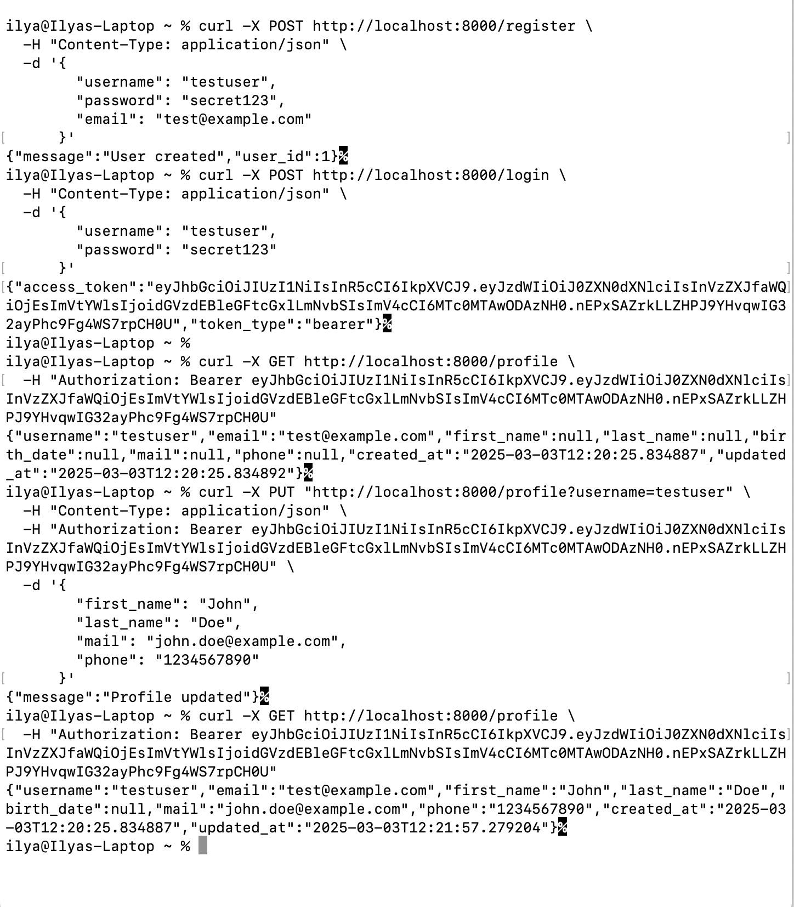

## Для запуска тестов достаточно выполнить pytest в корне контейнера каждого из сервисов


## Curl запросы для тестирования:

### Регистрация пользователя

```
curl -X POST http://localhost:8000/register \
  -H "Content-Type: application/json" \
  -d '{
        "username": "testuser",
        "password": "secret123",
        "email": "test@example.com"
      }'
```

### Логин 

```
curl -X POST http://localhost:8000/login \
  -H "Content-Type: application/json" \
  -d '{
        "username": "testuser",
        "password": "secret123"
      }'
```

### Получение профиля

```
curl -X GET http://localhost:8000/profile \
  -H "Authorization: Bearer <access_token>"

```

### Обновление данных

```
curl -X PUT "http://localhost:8000/profile?username=testuser" \
  -H "Content-Type: application/json" \
  -H "Authorization: Bearer <access_token>" \
  -d '{
        "first_name": "John",
        "last_name": "Doe",
        "mail": "john.doe@example.com",
        "phone": "1234567890"
      }'
```


### Повторное получение профиля с новыми данными

```
curl -X GET http://localhost:8000/profile \
  -H "Authorization: Bearer <access_token>"

```

### пример тестирования:

